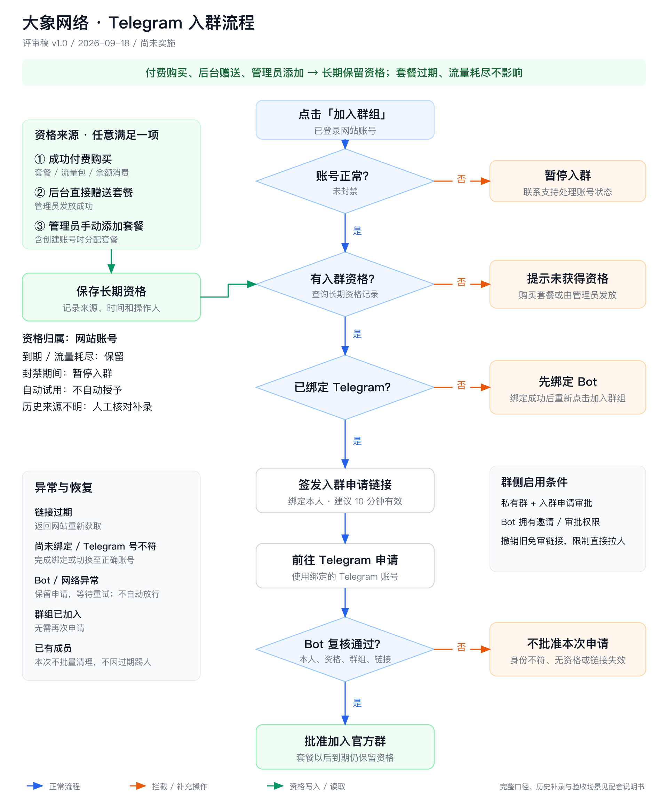

# 大象网络 Telegram 官方群入群流程说明书

版本：v1.1 · 2026-09-18

状态：**方案已确认，代码实现及本地验收完成。** 上线步骤、补录命令和验收结果见 [上线和运行说明](2026-09-18-telegram-group-access-rollout.md)。

## 1. 已确认的核心规则

用户满足以下任意一项，即可获得长期入群资格：

1. 成功付费购买过服务。
2. 管理员在后台直接赠送过套餐。
3. 管理员手动添加过套餐。

**以上三类用户，套餐过期后均保留入群资格。流量耗尽也不影响资格。**

资格归属于网站账号；绑定 Telegram 用于确认实际申请入群的人。获得资格不等于已加入群，仍需要完成绑定和入群申请。

本方案采用已确认口径：付费流量包和账户余额消费计入付费；管理员创建账号时分配套餐计入管理员发放；自动注册试用不自动授予资格。账号封禁期间暂停入群，但保留原资格记录。

## 2. 一图看懂

以下配图保留首次评审稿，业务规则不变；当前实施状态以上述说明为准。

[SVG 矢量原图](assets/2026-09-18-telegram-group-access-flow.svg)

## 3. 资格判断表

| 场景 | 入群资格 | 说明 |
| --- | --- | --- |
| 已成功购买套餐，正在使用 | 有 | 记录成功付费来源 |
| 曾购买套餐，已经过期 | 有 | 不要求续费后才能入群 |
| 付费套餐流量用完 | 有 | 不以剩余流量判断 |
| 购买过不限时套餐或付费流量包 | 有 | 服务类型不影响历史付费资格 |
| 使用账户余额完成有金额的购买 | 有 | 应付现金为零不代表免费订单 |
| 后台直接赠送套餐 | 有 | 无需伪造付费订单 |
| 管理员手动添加套餐 | 有 | 套餐发放成功时写入资格 |
| 管理员赠送、添加的套餐已过期 | 有 | 与付费资格同样长期保留 |
| 管理员创建账号时分配套餐 | 有 | 记录管理员发放来源 |
| 仅注册账号，未付费也未获管理员发放 | 无 | 展示获取资格的说明 |
| 仅领取系统自动试用 | 无 | 自动试用不等于管理员赠送 |
| 仅存在未支付或取消订单 | 无 | 不因创建订单就授予资格 |
| 用户自行使用全额优惠得到零元订单 | 不凭此订单授予 | 如同时有历史付费或管理员发放，则按其他来源放行 |
| 仅充值余额但尚未购买服务 | 不凭充值授予 | 本方案按服务购买记录判断 |
| 已有资格，但账号被封禁 | 暂停入群 | 解封后按原资格重新判断 |
| 已有资格，但未绑定 Telegram | 保留资格，先完成绑定 | 不当作无资格用户引导付费 |
| 老用户套餐来源无法确认 | 待核对补录 | 不能仅凭当前 plan_id 推断来源 |

“余额消费计入付费”意味着系统按实际扣除的账户余额认可购买，不在本次追溯余额来自充值、佣金还是后台赠送。赠送余额但尚未购买服务，不会直接获得资格。礼品卡自动兑换、外部导入等其他发放渠道不默认为管理员手工赠送；有其他有效来源的用户仍可入群，没有来源的按历史核对处理。

## 4. 用户完整操作流程

### 第一步：登录并点击「加入群组」

保留仪表盘现有 Telegram 服务卡片。用户点击后，按钮短暂显示“正在检查…”，阻止重复提交。后端根据登录身份校验，不接收前端指定的其他用户 ID。

会话失效时提示重新登录；账号封禁时暂停流程。资格检查失败或服务异常时，不自动跳转群链接。

### 第二步：检查长期入群资格

**有资格：** 继续检查 Telegram 绑定状态，无需检查套餐到期时间或流量余额。

**无资格：** 展示说明弹窗：

> 官方群面向已购买服务或由管理员开通套餐的用户开放。套餐过期后仍可加入。

提供“前往购买”和“我知道了”。对历史发放来源不明的用户，提供联系支持核实的说明，避免直接断言用户从未获得过套餐。

### 第三步：确认 Telegram 身份

**已经绑定：** 继续申请入群。

**尚未绑定：** 展示现有绑定 Bot 弹窗，说明“你已获得入群资格，请先绑定 Telegram 账号”。用户打开 Bot，复制绑定命令并发送，收到绑定成功回复后，返回网站重新点击“加入群组”。后端重新读取绑定状态，不依赖之前缓存的数据。

没有资格的用户不能通过绑定 Bot 自动获得资格。绑定、入群是两个独立操作。

### 第四步：获取并打开申请链接

后端确认资格和绑定均有效后，创建短期的“需要审批”邀请链接。建议有效期为 10 分钟。

网站显示：

> 资格验证通过，请使用已绑定的 Telegram 账号申请入群。链接 10 分钟内有效。

提供“前往 Telegram 申请入群”按钮。用户主动点击后打开 Telegram，避免异步检查结束时浏览器拦截新窗口。后端签发的链接与网站用户、绑定的 Telegram ID、目标群关联；Telegram 链接本身不具备“绑定本人”的能力，身份限制由 Bot 审核实现。

同一用户短时间重复点击，可复用仍有效的申请链接；不持续创建大量邀请链接。只有成功创建链接后才展示成功状态。

### 第五步：在 Telegram 中申请加入

用户使用网站绑定的 Telegram 账号点击“申请加入”。此时处于等待审核状态，还未获得群成员身份。

Bot 收到入群申请后核对：

1. 申请来自配置的目标官方群。
2. 使用的是系统签发且未撤销的申请链接。
3. 实际申请人的 Telegram ID 与该链接关联的用户一致。
4. 网站账号仍存在、未被封禁，且保有入群资格。
5. 申请提交时间处于链接允许的时间范围内。

所有条件通过，Bot 调用批准接口；明确不符合条件则拒绝本次申请。套餐已过期或流量用完不是拒绝理由。

### 第六步：加入成功

只有 Telegram 批准接口确认成功，才记录为“入群成功”；网站已发出链接不能当作入群成功。

成功后将该邀请标记为已使用，并尝试撤销链接。重复通知和重复回调按同一次申请处理，避免重复操作。以后套餐到期，不自动取消资格或踢出群。

已在群内的用户无需再次申请；已退出的用户可以按同一流程重新申请，不需要再次购买套餐。

## 5. 为什么需要长期资格记录

当前套餐字段会被续费、换套餐和后台修改覆盖，无法完整表达“曾经由管理员赠送过套餐”。仅查询当前套餐或订单，会漏掉没有订单的管理员发放用户。

建议新增独立资格记录，至少保存：

| 信息 | 用途 |
| --- | --- |
| 网站用户 ID | 资格归属 |
| 资格来源 | 成功购买、管理员赠送、管理员添加、历史补录 |
| 来源记录或订单 ID | 核对依据 |
| 首次获得时间 | 保留资格起点 |
| 操作管理员及备注（适用时） | 说明手动发放或补录的依据 |

资格写入必须与付款确认或管理员套餐发放成功关联；操作失败、事务回滚时不能留下资格。重复付款通知、重复保存不得反复创建相同来源记录。

不能因为管理员只修改了用户邮箱、备注等其他字段，就把该账号的自动试用套餐认作新赠送套餐。需要识别实际发生的套餐发放动作。

套餐到期、流量耗尽、换套餐或历史订单归档，不自动清除已取得的资格。账号封禁作为另一项实时检查，不覆盖资格来源。

退款、人工撤销资格、账号删除后的处理不在本次默认策略中新增自动操作；如需这些管理能力，另行确认。永久保留指账号正常存续期间不因套餐自然到期失效。

## 6. 老用户如何接入

上线前先做只读盘点，生成待确认结果，不直接批量修改用户：

1. **能确认成功付费的用户：** 根据历史成功支付记录补录资格，不要求当前套餐有效。识别余额支付和已折抵的历史付费订单；不能把有 paid_at 的零元免费单一律认作付费。
2. **能确认管理员发放的用户：** 依据现有可用的发放记录、审计记录或管理员确认补录，包含已过期套餐。
3. **仅能看到当前套餐，无法确认来源的用户：** 列入人工核对清单。不能把所有有 plan_id 的用户批量放行，因为系统自动试用同样会设置套餐。
4. **套餐已被移除、旧操作记录缺失的赠送用户：** 由管理员核实后补录，不依靠系统猜测。

确认名单后再执行一次性补录。新版本上线后的管理员发放会自动记录资格，不再依赖回溯。

需要在正式切换前完成主要历史名单核对，避免把已确认的老赠送用户当成新注册用户拒绝。

## 7. 异常处理与防绕过

| 情况 | 处理方式 | 用户如何继续 |
| --- | --- | --- |
| 付费用户转发邀请链接 | 申请人 ID 不匹配，不批准 | 接收者使用自己的账号获取资格并申请 |
| 有资格但用了另一个 Telegram 账号 | 不批准本次申请 | 切换至已绑定账号 |
| 链接已过期，尚未提交申请 | 不再接受新的申请 | 返回网站重新获取 |
| 在有效期内提交，但 Bot 处理延迟 | 依据申请提交时间校验 | 等待重试，不因处理晚到就误拒绝 |
| Bot 或 Telegram 网络暂时异常 | 不自动放行；申请保持待处理，记录并重试 | 页面说明稍后重试；持续失败转人工处理 |
| 发链接后账号被封禁 | 审核时再次检查并拒绝 | 处理账号状态后重新申请 |
| 审核通知重复到达 | 幂等处理，查询或沿用已确认结果 | 不要求用户重复操作 |
| 原有绑定存在重复或来源异常 | 不任意选择第一个网站账号放行 | 先由管理员核对归属 |
| 群已加入 | 不重复要求申请 | 直接打开已加入的群或提示已加入 |

资格长期记录和短期邀请记录分开保存。邀请关联不能随着 10 分钟链接到期立即全部删除，否则无法核验已提交但延迟处理的申请。

本次不新增自助切换 Telegram 账号功能。以后若调整绑定，待处理的旧链接应失效；旧账号已在群内的迁移与移除要有独立流程，不能通过反复换绑让同一个网站账号给多个 Telegram 账号放行。

## 8. Telegram 群配置要求

网页按钮限制无法阻止用户从其他渠道直接进群，正式启用需要同步完成群侧设置：

1. 配置唯一目标群 ID，并确认对应正确的官方群。
2. 建议使用私有群，统一通过需要审批的邀请链接加入。
3. 将网站绑定使用的 Bot 设为群管理员，并授予邀请、审批所需权限。
4. 确认 Bot 的 webhook 能接收 chat_join_request，继续保留已有消息及回调能力。
5. 撤销旧的免审核入群链接；各管理员创建的链接分别核对，不能假设当前 Bot 能撤销其他管理员的链接。
6. 限制普通成员直接拉人，其他管理员不绕过网站资格审核随意批准。

沿用当前账号绑定 Bot 处理入群；不把工单 Bot 混入这条流程。

现有群成员在本次上线时不批量清理，套餐过期也不自动踢人。本功能保证的是新申请经规则审核，不能把它表述成对全部既有成员完成了资格审计。

Telegram 官方接口依据：

- [创建需要审批的邀请链接](https://core.telegram.org/bots/api#createchatinvitelink)：支持有效期和 creates_join_request；审批模式不同时设置 member_limit。
- [批准入群申请](https://core.telegram.org/bots/api#approvechatjoinrequest)：Bot 需为管理员并具有 can_invite_users 权限。
- [入群申请事件](https://core.telegram.org/bots/api#chatjoinrequest)：提供实际申请人、群组、申请时间和邀请链接等信息。

## 9. 界面文案建议

| 状态 | 文案 | 操作 |
| --- | --- | --- |
| 检查中 | 正在检查入群资格… | 暂停重复点击 |
| 没有资格 | 官方群面向已购买服务或由管理员开通套餐的用户开放，套餐过期后仍可加入。 | 前往购买 / 我知道了 |
| 有资格，未绑定 | 你已获得入群资格，请先绑定 Telegram 账号。 | 打开绑定弹窗 |
| 绑定操作完成后 | 绑定成功后，请返回网站重新点击“加入群组”。 | 再次校验 |
| 可以申请 | 验证通过，请使用已绑定的 Telegram 账号申请入群。链接 10 分钟内有效。 | 前往 Telegram 申请入群 |
| 来源待核对 | 若套餐由管理员开通，请联系支持核实入群资格。 | 联系支持 |
| 服务异常 | 入群服务暂时不可用，请稍后重试。 | 重试 / 关闭 |
| 账号异常 | 当前账号暂不可申请入群，请联系支持。 | 联系支持 |

页面只展示用户需要理解的原因，不显示数据库字段、审核内部标识或敏感链接日志。

## 10. 实施与验收清单

实现范围与验收要求：

1. 实现统一资格判断和长期资格记录，覆盖订单成功与管理员套餐发放入口。
2. 实现资格查询和短期申请链接接口，停止从普通用户配置中直接下发原始群链接；检查其他用户入口，避免旧入口绕过。
3. 更新“加入群组”的检查、绑定引导和申请提示，保持现有卡片布局，镜像同步 theme/public 资源。
4. 更新 Bot 入群审核，增加目标群、申请人、资格、邀请关联校验，以及幂等与失败重试。
5. 本地验证后，整理历史用户盘点结果及群配置检查结果，再安排正式切换。

至少验收以下场景：

- 当前付费、历史付费过期、流量耗尽均可申请。
- 管理员赠送、手动添加及其过期用户均可申请。
- 付费流量包与余额消费可申请，自动试用和未支付订单不能授予资格。
- 有资格未绑定时只引导绑定，不要求再次购买。
- 链接被转发、Telegram 账号不一致时不批准。
- 有效期内的延迟申请不被误拒绝，已过期链接不接受新申请。
- 付款或管理员发放失败不写入资格；重复通知不产生错误记录。
- Bot 暂时不可用时不自动放行，可恢复重试。
- 非目标群事件不受本功能处理。
- 既有群成员不批量清理，套餐自然到期不踢人。
- 桌面和手机端都能完成检查、绑定引导和跳转，消息提示不被遮罩遮挡。

**交付边界：代码及本地验收已完成；正式上线还需历史资格核对补录、群侧配置、生产发布与真实 Telegram 验收。**
